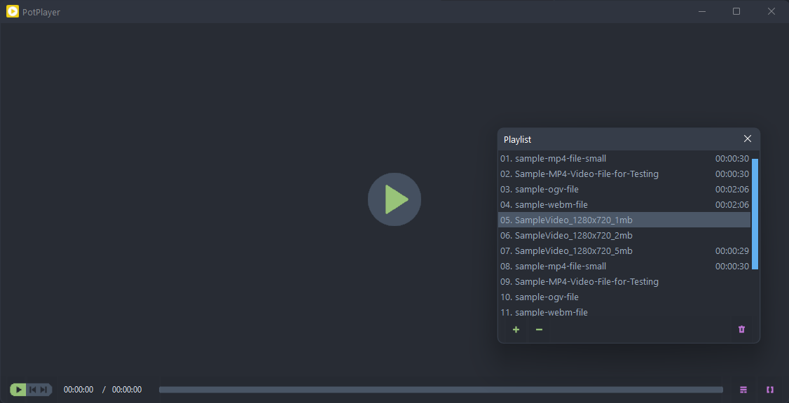
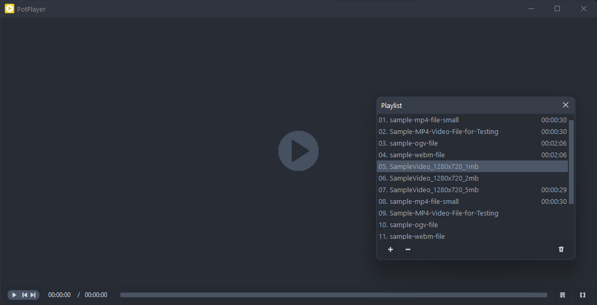
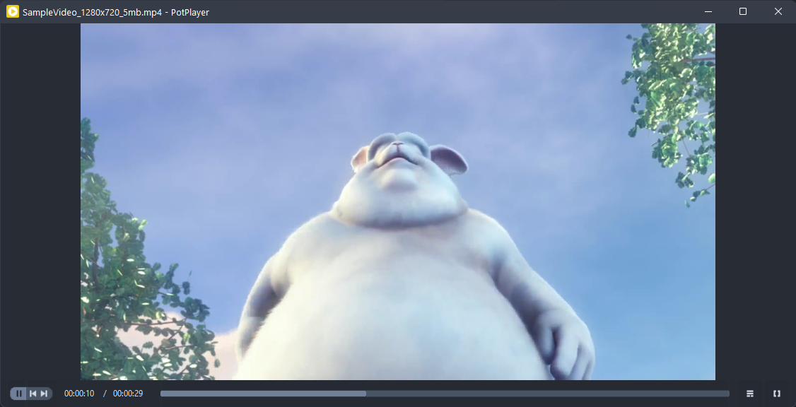

Atom One Dark inspired theme for PotPlayer.    

If you want an appropriate background, set the color in the settings: R:40, G:44, B:52.  

To change the title color of an inactive window, import following reg-key:

```reg
[HKEY_CURRENT_USER\Software\Microsoft\Windows\DWM] 
"AccentColorInactive"=dword:ff3f342f
```

Skin based on the Simplify Sunset.  

## OneDark

  

  

## OneDark-Muted

There is also a more minimalistic version with calmer muted colors.  

  

  
